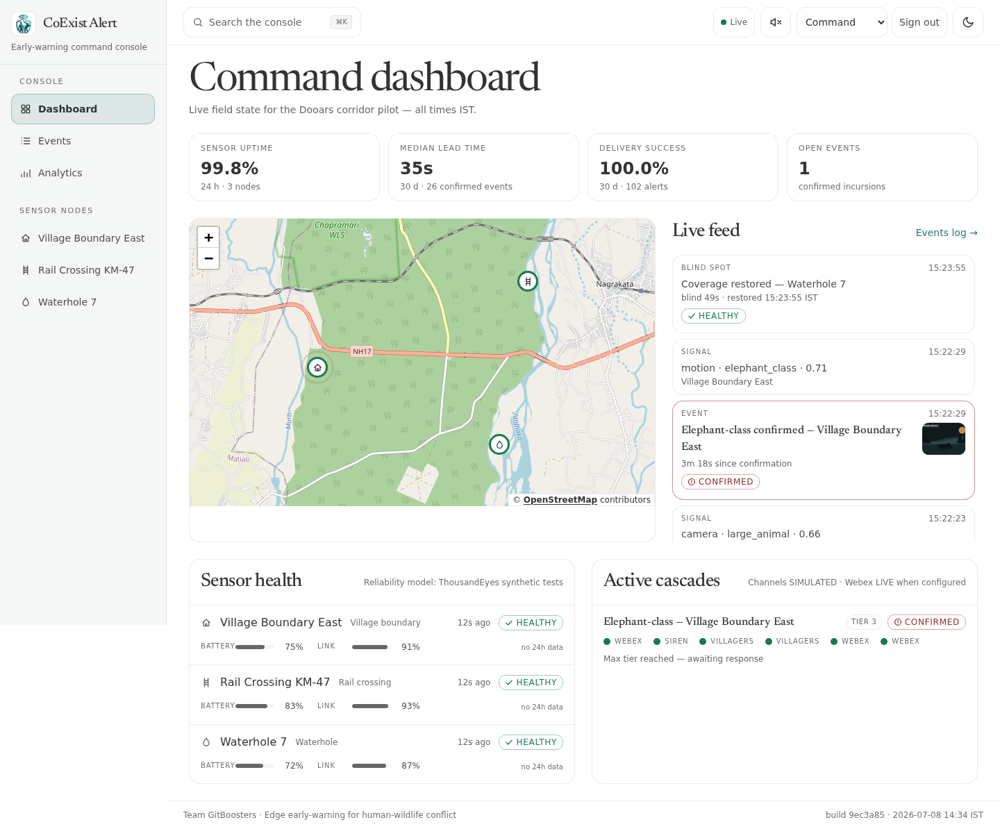
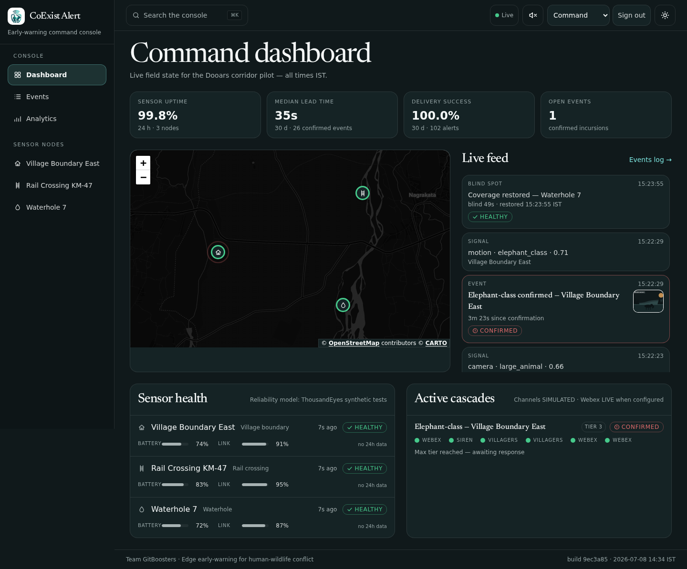
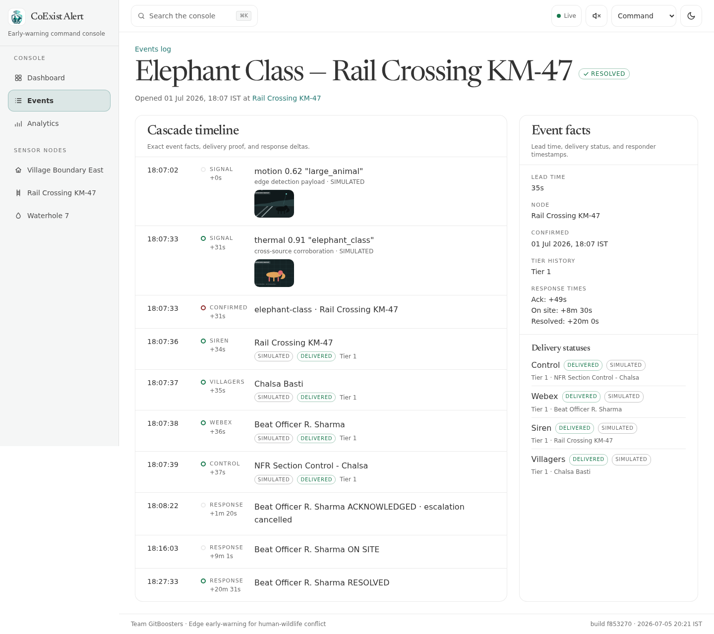
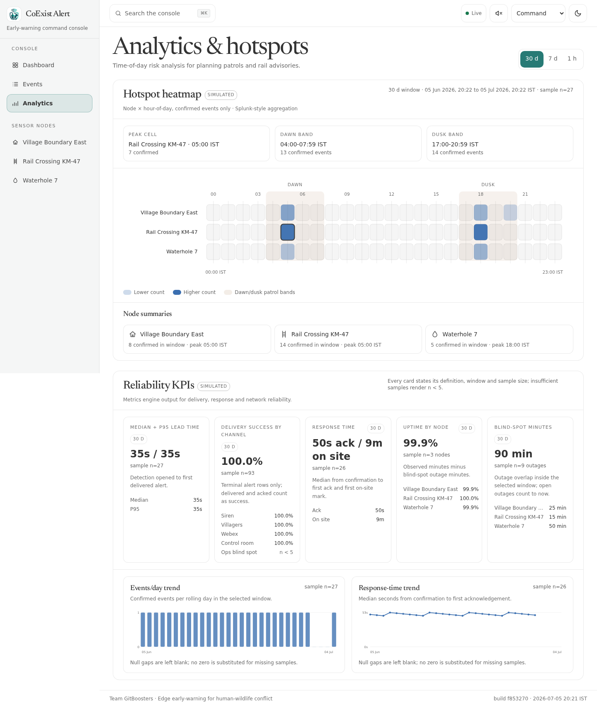
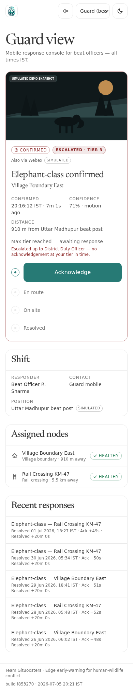

# CoExist Alert

<p align="center">
  
</p>

**Edge early-warning for human-wildlife conflict.**
Code with Cisco · Silver Flag CSR Challenge · Mission 3 — Human-Animal Coexistence · Team **GitBoosters**

> Live demo: **[coexist.yashkumarvaibhav.me](https://coexist.yashkumarvaibhav.me)**

## The problem

Human-wildlife conflict kills people and animals every day at the forest edge. In India, elephants kill hundreds of people a year, and elephant–train collisions kill dozens of elephants. The tragedy is almost always about **time and warning**: a villager at dawn, a night bus, a train driver — none of them has an advance signal that an animal is on the path, and forest guards learn of incursions only after the damage is done. Walls, trenches and patrols are static. The missing capability is **real-time detection at the edge plus instant, reliable, targeted, multi-channel warning** — a sensing-and-network problem.

## The solution

CoExist Alert is an early-warning platform for the forest-village boundary and rail crossings. It demonstrates the full life-critical loop:

1. **Detect** — edge sensor nodes (cameras, thermal, acoustic, motion) report animal-presence signals with snapshots and confidence scores.
2. **Confirm** — false-positive suppression: a high-confidence signal, or two corroborating signals from different sources within a short window, confirm an event. Weak single signals never cry wolf — alert fatigue is the fastest way to lose a community's trust.
3. **Warn** — an alert cascade fires in seconds: local siren, geofenced villager phone alerts, a **real Cisco Webex message** with snapshot and map link to the nearest guard, and a slow/stop advisory to the rail control room.
4. **Escalate** — unacknowledged alerts escalate to the next responder tier on a timer. A warning nobody saw is not a warning.
5. **Respond** — guards acknowledge → en route → on site → resolved; response times are recorded per event.
6. **Observe** — every node's link and battery health is continuously monitored. A dead sensor is itself an alert: *"this corridor is now blind — dispatch a patrol."*
7. **Learn** — hotspot analytics (node × time-of-day) and reliability KPIs drive patrol planning.

**The star of the show is the alert cascade and network reliability, not ML.** Detection classification arrives from the edge already labelled with confidence — in production that inference runs *on the camera* (Meraki MV), not in this platform.

## Screens

The command dashboard in light and dark — one persistent process driving a live sensor map, a KPI strip, the event feed, the sensor-health board and active alert cascades:

| Light | Dark |
|---|---|
|  |  |

**Event proof timeline** — every event is auditable end to end: signal → cross-source confirmation → per-channel delivery → acknowledge → on site → resolved, with exact IST timestamps and deltas. Simulated channels are labelled; only real Webex sends read `LIVE`.



**Analytics & hotspots** — a node × time-of-day risk heatmap plus reliability KPIs: median/p95 lead time, per-channel delivery success, response time, uptime and blind-spot minutes.



**Guard mobile view** — the beat officer's incoming-alert console with snapshot, distance from post, and the Acknowledge → En route → On site → Resolved response ladder.

<p align="center"></p>

## Architecture

```
  FIELD (simulated, honestly labelled)
  N1 Village Boundary East   N2 Rail Crossing KM-47   N3 Waterhole 7
  [camera+motion]            [camera+thermal]         [camera+acoustic]
        │ heartbeats every 10s        │ detection signals (MV-Sense-shaped)
        ▼                             ▼
  POST /api/ingest/heartbeat    POST /api/ingest/detection
        │                             │
  ┌─────┴─────────────────────────────┴──────────────────────────────┐
  │              CoExist Alert server (Next.js, one process)         │
  │                                                                  │
  │  Node Health Engine        Event Confirmation Engine             │
  │  healthy→degraded→offline  high-confidence OR two-signal         │
  │  offline ⇒ BLIND-SPOT      corroboration in window; else expire  │
  │        │                             │ confirmed                 │
  │        │                   Alert Cascade Engine                  │
  │        │                   geofenced targeting → channel fan-out │
  │        │                   delivery tracking → tiered escalation │
  │        │                     │        │         │        │       │
  │        │                   Siren   Villager   Guard   Control    │
  │        │                   (sim)   phones     WEBEX   room       │
  │        │                           (sim)      (REAL)  (sim)      │
  │        ▼                                                         │
  │  SSE stream (/api/stream) → live dashboards                      │
  │  SQLite: nodes · signals · events · alerts · responses · outages │
  └──────────────────────────────────────────────────────────────────┘
        ▼
  Command Dashboard · Guard Mobile View · Villager/Rail Channel Views
  Analytics & Hotspots · Demo Control Panel
```

- **One persistent Node server** (Next.js App Router) — escalation timers, heartbeat-timeout evaluation and server-sent events need long-lived process state.
- **SQLite via Drizzle ORM** — zero-setup for anyone cloning the repo; typed schema with a straightforward Postgres migration path for production.
- **Deterministic domain core** — health state machine, confirmation engine, cascade planner, escalation and metrics are pure, I/O-free TypeScript, written test-first. This logic is life-critical; it is provably correct or it is nothing.
- **In-process field simulator** drives the system **through the public ingest API** — the pipeline you see demonstrated is the pipeline that actually runs.

### Submission documentation

- [Architecture Decision Record](docs/adr.md) ([PDF](docs/adr.pdf)) — concise record of the major architecture decisions.
- [Architecture diagrams](docs/architecture.md) ([PDF](docs/architecture.pdf)) — system components, detection-to-warning sequence, escalation workflow and deployment flow.
- [Third-party notices](THIRD_PARTY_NOTICES.md) — direct open-source dependency attribution.

## Cisco technology mapping

Cisco products are the solution architecture here, not a decoration — and we are explicit about what is real versus simulated in this POC:

| Stage | Cisco product | In production | In this POC | Honesty label |
|---|---|---|---|---|
| **Sense** | Meraki MV smart cameras (MV Sense), MT sensors, Cisco Spaces | On-camera detection at hotspots publishes object-detection payloads | Simulator emits payloads **shaped like MV Sense outputs** (`classification`, `confidence`, snapshot ref); ingest validates them as untrusted edge input | `SIMULATED` chip on every field signal |
| **Observe** | ThousandEyes, Splunk | Node-to-server tests per site; alert on loss/latency; Splunk drives analytics | Heartbeat pipeline models ThousandEyes tests: missed beats ⇒ degraded/offline with the same alarm semantics; analytics engine is Splunk-style aggregation; the event log streams out as NDJSON at `GET /api/export/events.ndjson` for a Splunk HTTP Event Collector / forwarder | Health board labelled with its reliability model; export carries an `X-Coexist-Export: simulated-field-log` header |
| **Engage** | Webex APIs | Guard alert rooms, response coordination, control-room notifications | **REAL** — a bot posts an alert card (snapshot, facts, map link) to a Webex space when configured; delivery status comes from the API response; falls back to a simulated channel otherwise | `LIVE` / `SIMULATED` chip switches automatically |
| **Connect** | Meraki MG / Catalyst + mesh backhaul | Remote backbone from forest edge to command | Node `link_quality` models backhaul health; the backhaul topology is documented as the production path | `SIMULATED` link-health model |
| **Secure** | Duo / Secure Access / Umbrella | MFA on the command console; zero-trust responder access; DNS-layer protection for field gateways | **Real auth + RBAC** — signed-in accounts with scrypt-hashed passwords and HMAC session cookies; the request proxy gates every console and mutating API by role (a guard reaches only their console; field-driving controls are admin-only). **Cisco Duo OIDC MFA** is implemented with signed HS512 JWTs and gates the admin operations console when `DUO_CLIENT_ID`, `DUO_CLIENT_SECRET`, and `DUO_API_HOST` are configured. For the public demo, Duo is left dormant so reviewers can enter without third-party MFA friction; one-click demo accounts keep every console explorable | `LIVE` auth; `DORMANT` Duo unless env-configured |

**Why the network story matters:** detection is worthless if the warning silently fails. Monitoring the warning system itself — and alerting when a corridor goes blind — is what makes "a warning never silently fails" an honest promise. The network is the product.

## Measurable impact

- **Alert lead time** — seconds from detection to warning delivered (versus minutes-to-never today), shown live per event.
- **Delivery success rate** — per-channel delivery confirmation; no silent failures.
- **Guard response time** — detection → acknowledged → on site, tracked per event.
- **Sensor uptime / blind-spot minutes** — percentage of healthy time per node, and how long any crossing was blind (and that we alerted on it).
- **Hotspot coverage** — dawn/dusk risk windows identified per node, driving proactive patrols.

## Quickstart

### Easiest — Docker (nothing but Docker required)

No Node.js, no toolchain, no version matching. The image pins Node 24 and its own system libraries, so it runs identically on any machine with Docker:

```bash
git clone https://github.com/yashkumarvaibhav/CoExist-Alert.git
cd CoExist-Alert
docker compose up          # builds, migrates + seeds, then serves
# open http://localhost:3021
```

The DB is migrated and seeded during the build, so every screen has live data the moment the container starts. First build takes a couple of minutes; after that it's instant.

### Native — Node.js 20+ (built and tested on Node 24)

SQLite is bundled — no database server to install. If you use [nvm](https://github.com/nvm-sh/nvm), `nvm use` reads the shipped `.nvmrc` and selects the right Node for you:

```bash
git clone https://github.com/yashkumarvaibhav/CoExist-Alert.git
cd CoExist-Alert
nvm use           # optional: selects Node 24 from .nvmrc
npm install
npm run setup     # migrate + seed the local SQLite database
npm run dev       # http://localhost:3021
```

The seed loads the Dooars corridor demo: 3 sensor nodes, villager zones, responder tiers and a month of confirmed-event history, so every screen has live data on first load. Without Webex credentials the guard channel runs in labelled simulated mode — the full loop still works end to end.

Production build: `npm run build && npm run start` (port 8021).
Tests: `npm run test` (unit) · `npm run test:e2e` (Playwright).

### Signing in

The seed creates one-click demo accounts for every console — `commander`, `guard`, `range` and `control`, password `coexist-demo` — shown directly in the sign-in dialog. The field-driving demo panel (`/demo`) is admin-only: on a local run, sign in as `admin` / `coexist-admin` (set `COEXIST_ADMIN_PASSWORD` before `npm run setup` to choose your own). On the hosted demo the admin password is operator-held, so public visitors can explore every console but not drive the field.

### Live Webex channel

The guard Webex channel is live when credentials are present and simulated when they are absent.

1. Create a bot at developer.webex.com and copy its bot access token.
2. Create or choose a Webex space, add the bot to it, and copy the space ID.
3. Copy `.env.example` to `.env` and set:

```bash
WEBEX_BOT_TOKEN=...
WEBEX_ROOM_ID=...
COEXIST_PUBLIC_URL=https://coexist.yashkumarvaibhav.me
```

Successful Webex sends are stored as `LIVE`; missing credentials fall back to a terminal simulated delivery, and Webex API errors are stored as failed deliveries with the API reason surfaced.

**Acknowledge from inside Webex (optional).** Set `WEBEX_WEBHOOK_SECRET` to any strong random string to add an **Acknowledge** button to the alert card. On boot the app registers an `attachmentActions` incoming webhook with Webex pointing at `POST /api/webex/webhook` (the public URL must be reachable by Webex's cloud); each callback is authenticated by its `X-Spark-Signature` HMAC against the secret, then drives the same response pipeline as the in-app guard console — the tap acknowledges the event for real, cancels escalation, and threads a status reply under the alert. Leave the secret unset and nothing changes: no button, no webhook, and the endpoint is an inert no-op.

### Duo MFA gate

Admin-only demo controls can require a real Cisco Duo hosted MFA step-up. Create a Duo **Web SDK** application, set the redirect/callback URL to `https://coexist.yashkumarvaibhav.me/api/auth/duo/callback`, then set `DUO_CLIENT_ID`, `DUO_CLIENT_SECRET`, and `DUO_API_HOST` in `.env`. Leave any of them unset and Duo stays dormant: auth + RBAC still work, and `/demo` remains password-gated by the app session only. For the public judging demo, Duo is deliberately kept dormant because an external MFA enrollment step can block reviewers before they reach the product.

## Honesty rule

Every simulated element in the UI carries a visible `SIMULATED` chip; only real Webex sends show `LIVE`. Demo data is a fictionalized composite inspired by the Dooars elephant corridor (North Bengal), clearly labelled. We never fake a live-hardware claim.

## License

MIT. See [LICENSE](LICENSE).

## Team

**GitBoosters** — Yash Kumar Vaibhav (IIIT Delhi) · Varnika Pulipati (IIITDM Jabalpur) · Adeesh Jain (BITS Pilani Goa)
