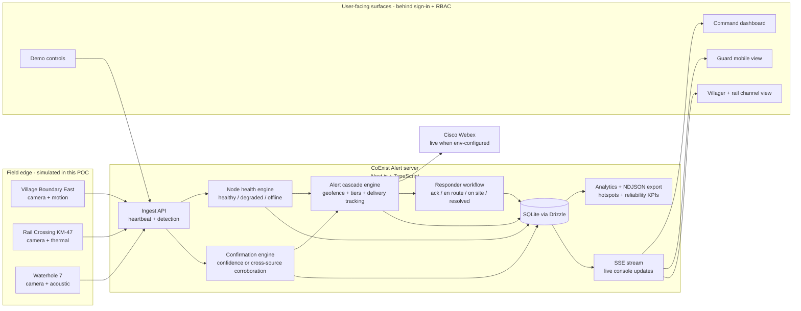
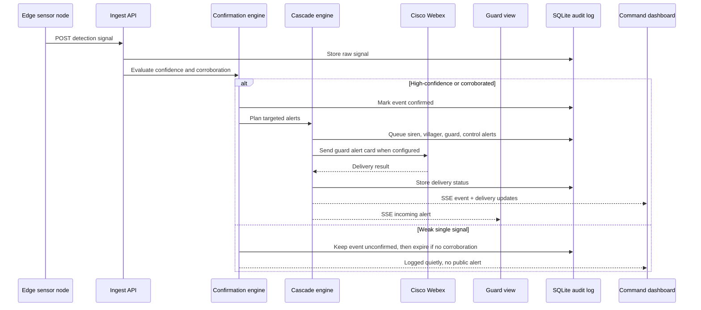
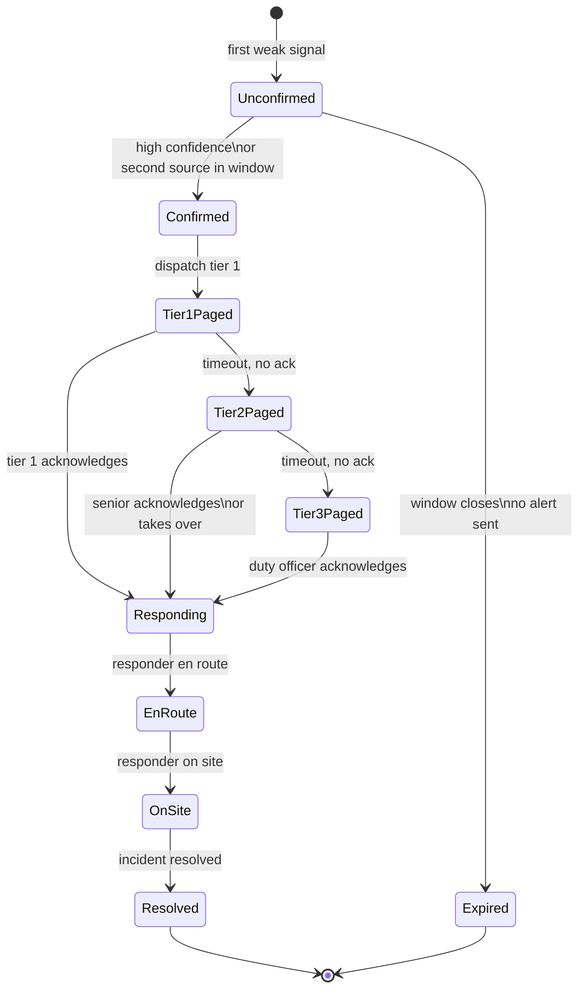
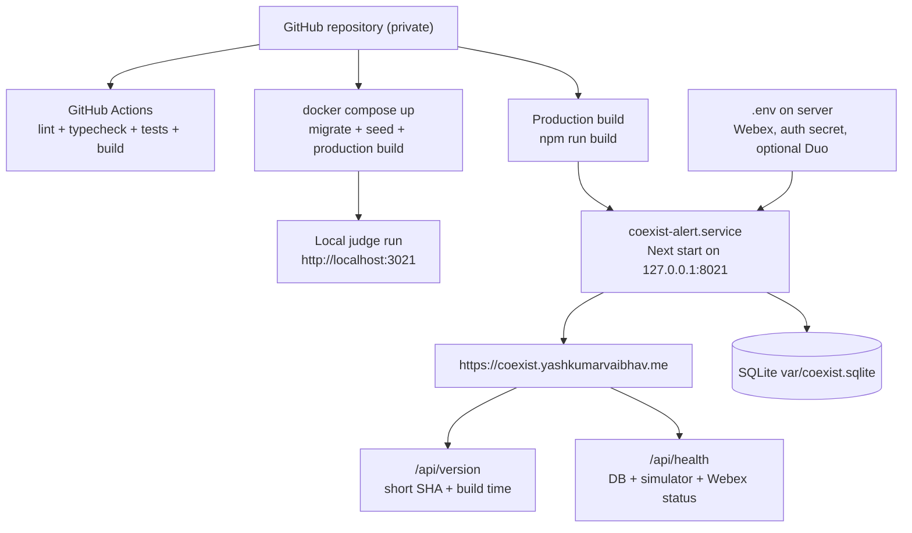

# Architecture Diagrams

These diagrams summarize the major components and workflows behind CoExist Alert. The live app is the source of truth; simulated field elements are explicitly labelled in the UI.

## 1. System Components

## 2. Detection To Warning Sequence

## 3. Escalation And Ownership Workflow

## 4. Runtime And Deployment Flow

